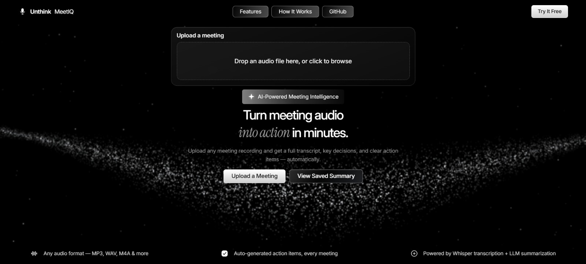
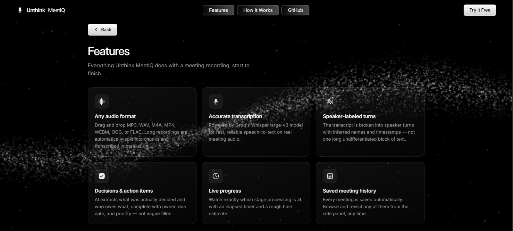
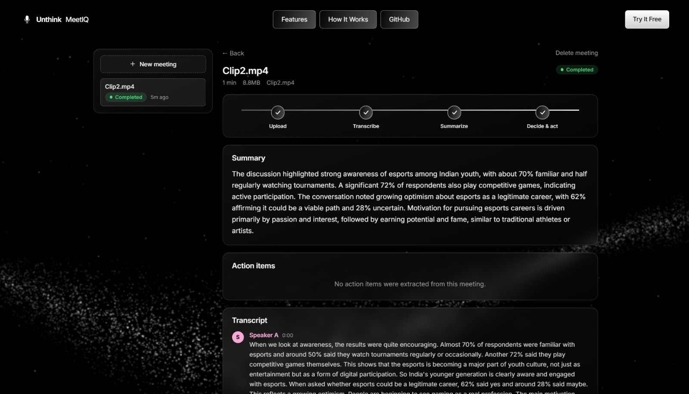

<h1 align="center">Unthink MeetIQ</h1>

<p align="center">
  
</p>

<p align="center">
  
</p>
<p align="center">
  
</p>
<p align="center">
  
</p>

**Live:** https://unthink-meetiq.centralindia.cloudapp.azure.com

Upload a meeting recording, get back a transcript with speaker turns, a narrative overview, key decisions, and checkable action items — in any language the meeting was conducted in, summarized in English.

Built on Groq's free, low-latency hosting of Whisper (ASR) and an open-weight 120B model (summarization), so the whole pipeline runs at **$0 API cost** and processes a typical short meeting in a few seconds.

## Stack

- **Backend:** FastAPI + SQLAlchemy + SQLite
- **ASR:** Groq — `whisper-large-v3`, auto-detects the spoken language (Hindi, Hinglish, and ~99 others work with no configuration)
- **LLM:** Groq — `openai/gpt-oss-120b`, structured JSON output, always summarizes in English regardless of the meeting's language
- **Frontend:** React + Vite + TypeScript, plain CSS — no UI framework, no router. Dependencies were kept to only what each piece strictly needs (no Alembic, no Celery/Redis, no Tailwind)
- **Hosting:** a single always-on Azure VM (nginx + systemd), HTTPS via Let's Encrypt — see *Deployment* below

## Setup

**Backend:**

```bash
cd backend
python -m venv .venv
.venv\Scripts\activate        # Windows
# source .venv/bin/activate   # macOS/Linux

pip install -r requirements.txt
copy .env.example .env        # Windows: copy, macOS/Linux: cp
```

Fill in `GROQ_API_KEY` in `.env` — a free key from https://console.groq.com (no card required). Optionally set `GROQ_API_KEY_DIARIZE` to a second Groq account's key so speaker-labeling calls (the highest-volume part of the pipeline) get their own separate rate-limit budget instead of competing with summarization; leave it unset to use the same key for everything.

**ffmpeg is also required** (long-audio chunking and duration detection) — install it and make sure it's on your PATH:
- Windows: `winget install Gyan.FFmpeg`
- macOS: `brew install ffmpeg`
- Linux: `apt install ffmpeg` (or your distro's equivalent)

Run the API:

```bash
uvicorn app.main:app --reload --app-dir .
```

Docs at http://127.0.0.1:8000/docs. `GET /api/health` should return `{"status": "ok"}`.

**Frontend:**

```bash
cd frontend
npm install
copy .env.example .env        # Windows: copy, macOS/Linux: cp
npm run dev
```

Opens at http://localhost:5173. Expects the backend running at `VITE_API_BASE_URL` (default `http://127.0.0.1:8000`) — start the backend first.

## How it works

1. Upload an audio file. Short/small ones start transcribing immediately.
2. A meeting over **15 minutes or 20MB** stops at `pending_confirmation` instead of processing automatically — the frontend shows a warning ("This meeting is about 18 min long... Continue?") and waits for you to accept before anything runs.
3. Groq transcribes the audio — chunked on silence and stitched back together for long meetings, transcribing up to 3 chunks concurrently (stays under Groq's per-file limit and the free-tier rate limit at the same time). Any spoken language is transcribed as-is.
4. A second pass groups the raw transcript into speaker turns ("Speaker A", "Speaker B", or real names if stated), inferred from conversational context — Whisper itself has no speaker identity, so this is LLM-inferred rather than audio-based diarization.
5. Groq summarizes the speaker-labeled transcript into an overview, key decisions, and action items as validated, schema-checked JSON, always written in English. Long/chunked meetings automatically use a two-pass extract-then-structure prompt instead of a single pass — see *Prompt design* below for why.
6. Status moves through `uploaded → transcribing → transcribed → summarizing → completed`, or `failed` with a specific error message at whichever stage broke. The frontend polls and updates live, showing an elapsed timer alongside a rough duration-based estimate.

## Privacy

There's no login (single-user by design, matching the assignment brief), but the app is publicly hosted, so meetings still need to stay private per-visitor. Each browser is silently issued a random id in an httpOnly cookie on first request; every meeting is tagged with it, and every read/write endpoint filters by it — including direct-by-ID access, which 404s instead of leaking existence. No accounts, no passwords, but nobody can see anyone else's meetings.

## Prompt design

Prompts live in `backend/app/prompts/v1.py`, versioned and logged per summary (`summaries.prompt_version`) so different prompt versions are traceable in the data, not just in commit history.

Two strategies, chosen automatically by meeting length:

- **Single-pass** (short meetings): one call asks for the full structured JSON directly from the transcript.
- **Two-pass, extract-then-structure** (meetings that triggered chunking): a first call pulls candidate decisions/commitments out of the transcript; a second call structures those into the final JSON. Splitting extraction from formatting measurably improves recall on long or messy transcripts — but this was tuned by hand: the first version quoted lines verbatim instead of synthesizing them, so "let's stick with the proposal" would pass through as a "key decision" instead of the actual substance. Fixed by asking both passes to write the *meaning* of what was said, not repeat the phrasing.

Both prompts explicitly instruct the model not to invent decisions, names, or dates — verified by hand: a chit-chat transcript with no real decisions correctly comes back with empty arrays, and the model correctly refuses to guess an ISO due-date from a relative term like "Friday" when no reference date is available, rather than hallucinating one. They also explicitly require English output regardless of the transcript's language — proper nouns (names, companies, products) are kept as spoken rather than translated.

## Reliability

The Groq SDK has its own internal retry/timeout behavior layered under the app's explicit retry-with-backoff logic — left at the SDK's defaults, one momentarily slow response could get retried inside the SDK *and then again* by the app's own loop, compounding into minutes of wall-clock delay for what's normally a few-second call. Client timeouts are now capped explicitly (30-45s) with the SDK's own retries disabled (`max_retries=0`), so the app's loop is the only retry layer and worst-case latency per call stays bounded. Each pipeline stage (transcription, diarization, summarization) also logs its own duration, so a slow run is diagnosable from the logs instead of guessed at.

## Testing

```bash
cd backend
pip install -r requirements-dev.txt
python -m pytest tests/ -v
```

Tests run against an isolated temp SQLite database (never the dev `app.db`) and mock the Groq calls, so they run in well under a second with no API key or network access needed. Coverage: upload validation, the full auto-processing pipeline (mocked ASR/LLM), failure-path error messages, the confirmation-gate 409/404s, action-item PATCH validation, and delete.

## API

| Route | Description |
|---|---|
| `POST /api/meetings` | Upload audio (multipart, field `file`, optional `title`). Auto-starts processing, or returns `pending_confirmation` for long/large files. |
| `POST /api/meetings/{id}/confirm-processing` | Accept the chunked-processing warning and start the background job. |
| `GET /api/meetings` | List the current visitor's meetings. |
| `GET /api/meetings/{id}` | Fetch one meeting (status, size/duration, error). |
| `GET /api/meetings/{id}/transcript` | The stitched transcript, with speaker turns. 404 until transcription finishes. |
| `GET /api/meetings/{id}/summary` | Overview, key decisions, and action items. 404 until summarization finishes. |
| `PATCH /api/action-items/{id}` | Toggle `open`/`done`, edit `owner` or `due_date`. |
| `DELETE /api/meetings/{id}` | Removes the meeting, its audio file, transcript, and summary. |

`POST /api/meetings/{id}/reprocess` (retry a failed meeting without re-uploading) was scoped out to keep the surface area focused on what the assignment brief asks for — deleting and re-uploading covers the same need for a demo-scale project.

## Frontend

A single page, switched between views by local state rather than a router — one more dependency wasn't worth it for a handful of screens. Framer Motion handles the transitions between them.

- **Upload** — drag-and-drop hero with an animated wave background, or "View Saved Summary" into an existing meeting
- **Meeting detail** — the confirmation banner for long/large meetings, a live processing indicator with elapsed time, then summary + checkable action items + speaker-turn transcript once ready, with a saved-meetings side panel and a delete option
- **Features** / **How It Works** — static informational pages reachable from the header
- Fully responsive down to small mobile widths

## Known limitations

- **Speaker diarization is LLM-inferred, not audio-based.** Whisper's transcription API doesn't separate speakers; turns are grouped by an LLM reading conversational context (pauses, "this is X", replies), not by voice/pitch analysis — correct in testing but not as reliable as ground-truth diarization.
- **No accounts.** Meetings are private per-browser via a cookie (see *Privacy* above), not behind a login — clearing cookies or switching browsers starts a fresh, empty identity.
- **Groq free-tier rate limits.** Fine for a demo; heavy concurrent use would need backoff tuning beyond the current 3-chunk concurrency cap.
- **SQLite.** Fine for a demo; the SQLAlchemy models are swappable to Postgres via `DATABASE_URL` with no code changes if this needed to scale.

## Deployment

Live on a single Azure VM (`Standard_B1s`, Ubuntu 22.04, Central India — see `deploy/redeploy.sh`):

- nginx serves the built frontend and reverse-proxies `/api`, `/docs`, `/redoc` to the backend on the same origin (no CORS, no cold starts)
- the backend runs as a systemd service (`meetiq-backend`) — auto-restarts on crash, auto-starts on reboot
- HTTPS via a free Let's Encrypt certificate with auto-renewal
- SQLite + uploaded audio persist on the VM's disk, unchanged from local dev

To push a new build after committing changes: `bash deploy/redeploy.sh` from the repo root — rebuilds the frontend, packages the backend, and deploys both with a brief service restart.

## Demo video

_[Add link here after recording.]_
